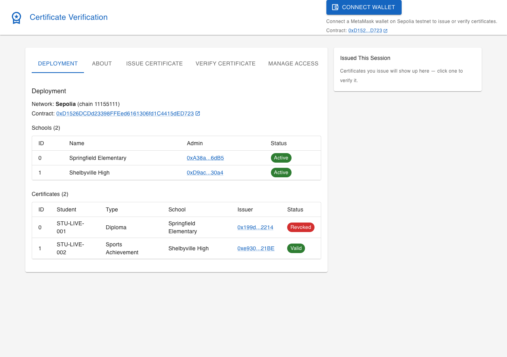
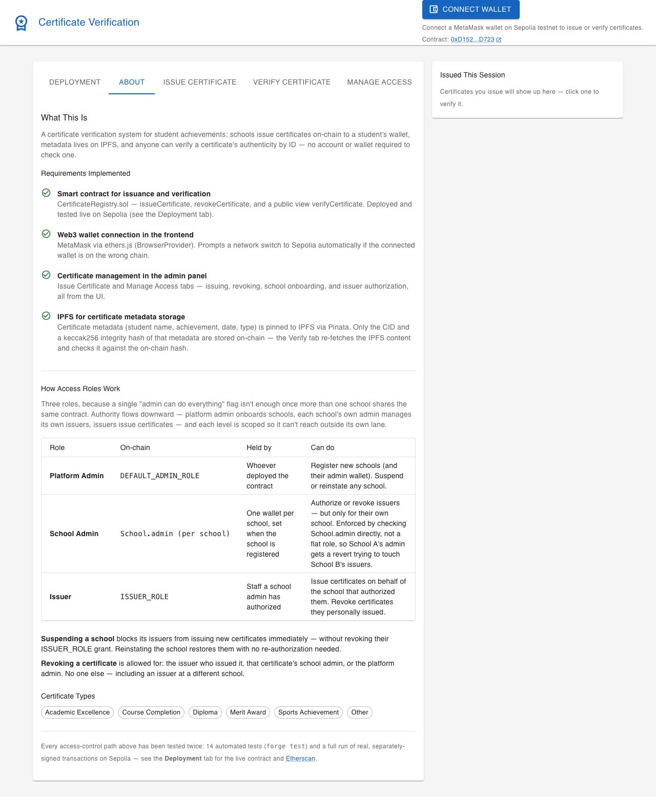
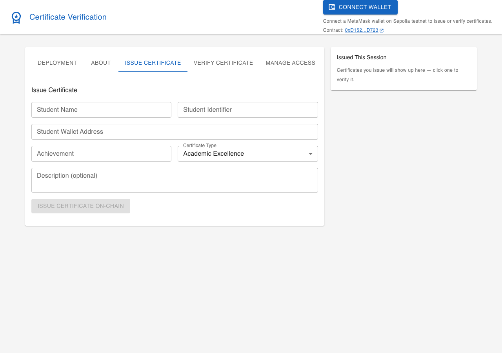
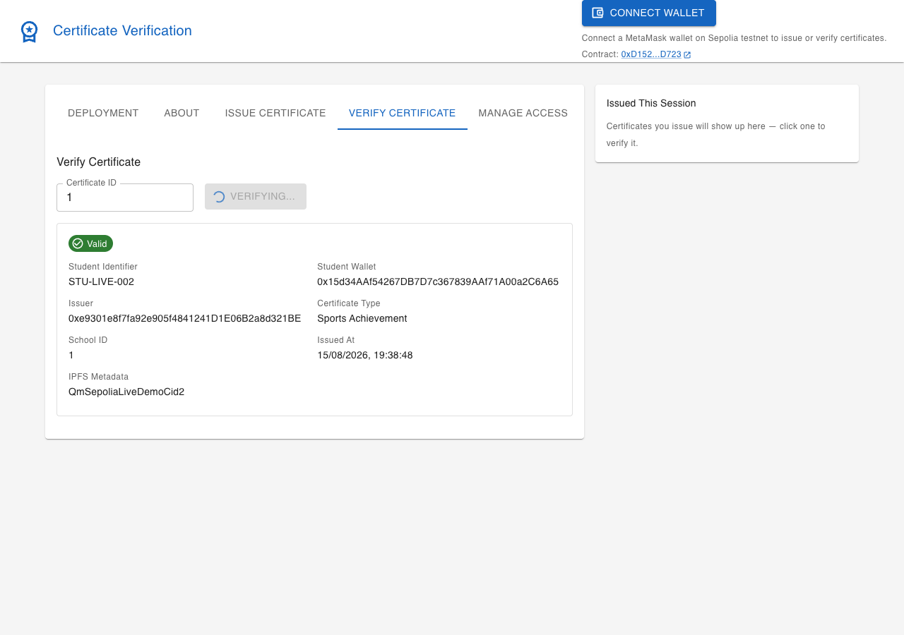
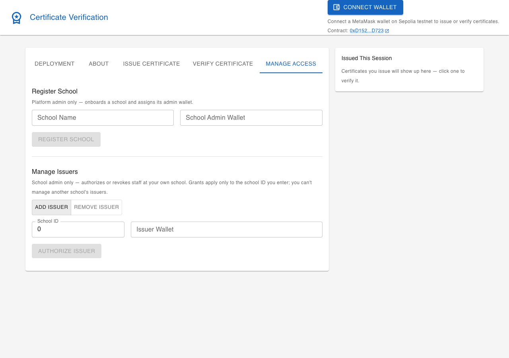

# Certificate Verification System

An on-chain certificate verification system for student achievements: smart
contract issuance and verification with role-based access control across
multiple schools, a Web3 frontend, and certificate metadata stored on IPFS.

## Overview

A full-stack Web3 application, entirely self-contained — no backend server
or database required. Everything is either on-chain (issuance, verification,
access control) or client-side (the React frontend talks directly to the
contract and to IPFS).

- **Smart contract** — issue, verify, and revoke certificates; a role
  hierarchy (platform admin → school admins → issuers) so multiple schools
  can share one contract without stepping on each other.
- **Frontend** — MetaMask wallet connection, an admin panel to issue
  certificates and manage schools/issuers, and a public verifier anyone can
  use without connecting a wallet.
- **IPFS** — certificate metadata (student name, achievement, date, type) is
  pinned off-chain; only a CID and an integrity hash live on-chain.

## Quick start — see the UI in under a minute

The live contract address is already baked into `frontend/.env.example`, so
you don't need to deploy anything or connect a wallet just to look around —
Deployment, About, and Verify all work read-only out of the box:

```bash
cd frontend
npm install
cp .env.example .env
npm run dev
```

Open `http://localhost:5174`. The **Deployment** tab loads by default and
shows the live contract, both schools, and both certificates read straight
from Sepolia. Try **Verify Certificate** with ID `1` — it'll resolve for
real, no wallet needed.

To actually issue certificates or manage schools/issuers, you'll additionally
need MetaMask, some Sepolia ETH, and a free Pinata API key — see **Building
it yourself** below.

## Screenshots

| Deployment (default view) | About |
|---|---|
|  |  |

| Issue Certificate | Verify Certificate |
|---|---|
|  |  |

| Manage Access |
|---|
|  |

## Live deployment (Sepolia)

`CertificateRegistry` is deployed and has real transaction history on Sepolia:

- **Contract**: [`0xD1526DCDd23398FFEed6161306fd1C4415dED723`](https://sepolia.etherscan.io/address/0xD1526DCDd23398FFEed6161306fd1C4415dED723)
- **Deploy tx**: [`0x0aa89673a5257e1c1e783c79dee7dbc291a7679718ee8f580f79ec098b8ca99f`](https://sepolia.etherscan.io/tx/0x0aa89673a5257e1c1e783c79dee7dbc291a7679718ee8f580f79ec098b8ca99f)

Every role in the access-control model has been exercised with a real,
separately-signed transaction — not simulated, not on a local chain:

| Step | Tx hash |
|---|---|
| Register School A ("Springfield Elementary") | [`0x2ccd8d06...a62de`](https://sepolia.etherscan.io/tx/0x2ccd8d06f4eb7e6706a33a8de685d000596927c18ca3f98af1390c9361ba62de) |
| Register School B ("Shelbyville High") | [`0xf6afe218...dc4e4`](https://sepolia.etherscan.io/tx/0xf6afe2185f950668ad56b23be34914ea6ca8100f58deb0e79ed6bed49f7dc4e4) |
| School A admin authorizes Issuer A | [`0xf55cc51a...98a4d6`](https://sepolia.etherscan.io/tx/0xf55cc51a7ae82d709a4ab9a84531e82bc2fde11546ea75d93d7491a40698a4d6) |
| School B admin authorizes Issuer B | [`0x03be98b0...4ceaea`](https://sepolia.etherscan.io/tx/0x03be98b04455b8cd9608de5fd0f4d839185aeff4f5703dd97948d797d44ceaea) |
| Issuer A issues certificate #0 (Diploma) | [`0x2695dbb5...3dfc8d4`](https://sepolia.etherscan.io/tx/0x2695dbb545963b4c7d63bf765353140b7b733439a9dc752a7082c93243dfc8d4) |
| Issuer B issues certificate #1 (Sports Achievement) | [`0x4141214d...9d43ab`](https://sepolia.etherscan.io/tx/0x4141214d47411c92909da4010bbb94c8452f7de2f5052084aa257e83a69d43ab) |
| Issuer A revokes certificate #0 | [`0x444e656e...c813af40`](https://sepolia.etherscan.io/tx/0x444e656ece377099dee44453caedbe239a9d3d272f4bf315210c2f78c813af40) |

Certificate #0 now reads back `revoked: true`; #1 is still valid — both
verifiable directly by calling `verifyCertificate(uint256)` on the contract
above, no wallet needed (it's a `view` function).

Every wallet involved (platform admin, both school admins, both issuers) is a
freshly generated burner, funded with a small amount of Sepolia ETH for this
demo alone — none of them are reused anywhere else.

## Status: built and verified

Both halves have been built and tested end-to-end:

```
$ forge test
Ran 14 tests for test/CertificateRegistry.t.sol:CertificateRegistryTest
[PASS] test_GetStudentCertificates() ... (+ 13 more)
Suite result: ok. 14 passed; 0 failed; 0 skipped

$ npx tsc --noEmit          # frontend type-checks clean
$ npm run build              # frontend builds clean (single-page app, ~820 kB bundle)
```

## What's here

```
contracts/                          Foundry project (forge test: 14/14 passing)
  src/CertificateRegistry.sol       Access-controlled issuance/verification contract
  script/DeployCertificateRegistry.s.sol   Deploy script (Sepolia)
  test/CertificateRegistry.t.sol    14 tests incl. cross-school isolation, RBAC reverts
  Makefile                          make install / build / test / coverage / deploy-sepolia
  foundry.toml, remappings.txt
  lib/forge-std, lib/openzeppelin-contracts   (git submodules, official repos — run `make install`)

frontend/                           Vite + React + TypeScript + MUI
  src/
    pages/certificates-page.tsx     Wallet connect + 5 tabs (see below)
    components/
      deployment-overview.tsx       Live on-chain state: all schools, all certificates
      about-overview.tsx            What was implemented + how the role model works
      issue-certificate-form.tsx    Admin: issue a certificate (with type dropdown)
      certificate-verifier.tsx      Anyone: verify a certificate by ID, no wallet needed
      manage-access.tsx             Register schools, authorize/revoke issuers
      recent-certificates-aside.tsx Session history — click an ID to jump to Verify
      wallet-connect-button.tsx     MetaMask connect + clickable deployed contract address
    hooks/use-wallet.ts             MetaMask connection + Sepolia network switch
    utils/contract.ts               Contract ABI + ethers.js helpers + cert type list
    utils/ipfs.ts                   Pinata-based metadata pin/fetch
    types/                          Zod schemas + TS types

docs/screenshots/                   Referenced in Screenshots section above
```

The five tabs, in the order they appear: **Deployment** (default — live
contract state), **About** (what was built + the role model, human-readable),
**Issue Certificate**, **Verify Certificate**, **Manage Access**.

## Access control model

Three roles, matching how a real multi-school deployment would need to work
— a single "admin can do everything" flag isn't enough once more than one
school is on the same contract:

| Role | Held by | Can do |
|---|---|---|
| **Platform admin** (`DEFAULT_ADMIN_ROLE`) | Whoever deploys the contract | Register new schools, suspend/reinstate a school |
| **School admin** | One wallet per school, set at registration | Authorize or revoke *their own school's* issuers. Enforced via `School.admin`, not just a role flag — School A's admin gets a revert if they try to touch School B's issuers (`test_RevertWhen_SchoolAdminManagesAnotherSchoolsIssuers`) |
| **Issuer** (`ISSUER_ROLE`) | Staff a school admin has authorized | Issue certificates on behalf of *their* school, revoke certificates they issued |

A suspended school's issuers are blocked from issuing (`test_SuspendedSchoolBlocksIssuance`), even though their `ISSUER_ROLE` grant itself isn't revoked — reactivating the school restores them without re-granting anything.

**Certificate types** — `AcademicExcellence`, `CourseCompletion`, `Diploma`, `MeritAward`, `SportsAchievement`, `Other` — are an on-chain enum, recorded per certificate and shown on both the issue form (dropdown) and verify result.

**Revocation** is allowed by: the issuer who issued it, that certificate's school admin, or the platform admin — not any other issuer, including one at a different school (`test_RevertWhen_UnrelatedIssuerRevokes`).

## Building it yourself

### Contracts

```bash
cd contracts
make install   # forge-std + OpenZeppelin, from their official GitHub repos
make build
make test              # or: make test-verbose / make coverage
cp .env.example .env   # fill in PRIVATE_KEY (testnet-only wallet) + RPC URL
make deploy-sepolia
```

Get free Sepolia ETH from a faucet (e.g. Alchemy's, Infura's, or Google
Cloud's Sepolia faucet) to pay for gas — never fund this wallet with real
assets. `rpc.sepolia.org` is frequently unreachable; `ethereum-sepolia-rpc.publicnode.com`
is a reliable free alternative (already the default in `.env.example`).

After deploying, the platform admin (the deployer wallet) needs to call
`registerSchool(schoolAdminAddress, "School Name")` once before any issuer
can be added — the "Manage Access" tab in the frontend does this.

### Frontend

```bash
cd frontend
npm install
cp .env.example .env
# already points VITE_CERTIFICATE_CONTRACT_ADDRESS at the live deployment above;
# fill in VITE_PINATA_JWT (free API key from pinata.cloud) to issue new certificates
npm run dev
```

Opens on `http://localhost:5174`. Connect MetaMask, switch to Sepolia when
prompted. As the platform admin wallet: register a school and its admin
under "Manage Access". As that school admin wallet: authorize an issuer.
As that issuer wallet: issue a certificate. Anyone can verify it by ID —
including certificate #1 from the live deployment above, right now, with no
wallet connection at all.

## Integration-friendly by design

Everything under `frontend/src/` (`types`, `utils`, `hooks`, `components`,
`pages`) is a self-contained feature module — no dependency on any specific
host application. To drop it into an existing React admin app:

- Copy `frontend/src/{types,utils,hooks,components,pages}` into a feature
  folder in the host app (e.g. `src/domains/certificate/`).
- Add `ethers` as a dependency (everything else used — MUI, react-hook-form,
  zod — is common enough to likely already be present).
- Add a route pointing at `<CertificatesPage />`.
- Optionally surface it from an existing page (e.g. a tab on a student
  profile page) instead of — or in addition to — its own route.

No backend server or database changes are needed anywhere in this flow — the
contract and IPFS handle all persistence, so the module is genuinely
drop-in.
